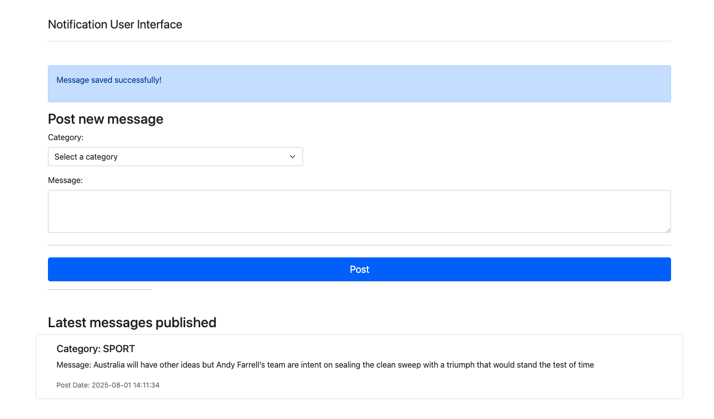

# notification-task
Service to delivery notifications


## Start application
This application starts as regular SpringBoot service
```mvn spring-boot:run``` 

## Go to User Interface 
local development  : http://localhost:8080/
It looks like -> 

### Post a new message
- Fill the category and Message section
- Click on ```POST``` button
- If operation is success, the blue banner is show. Otherwise, a red banner is show
- Messages Posted will be displayed in ```Latest messages published``` section