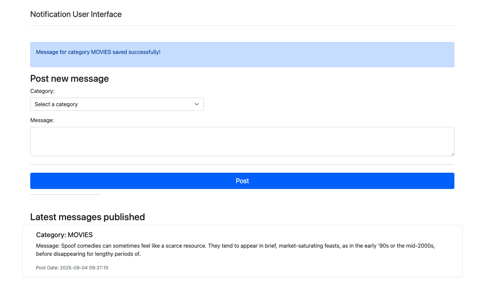
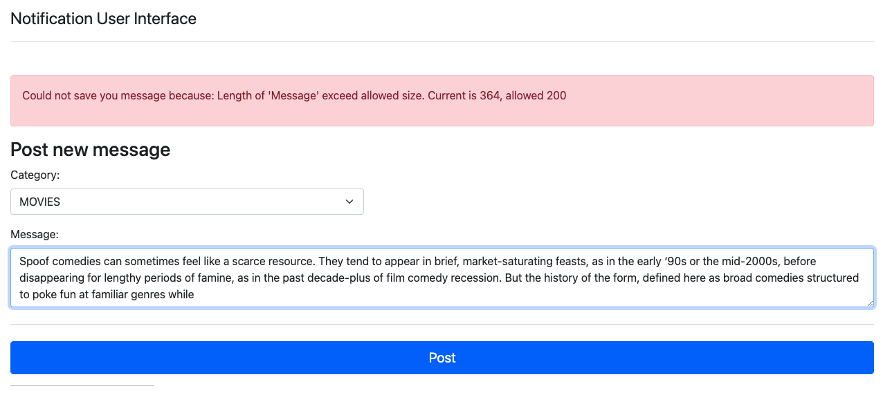
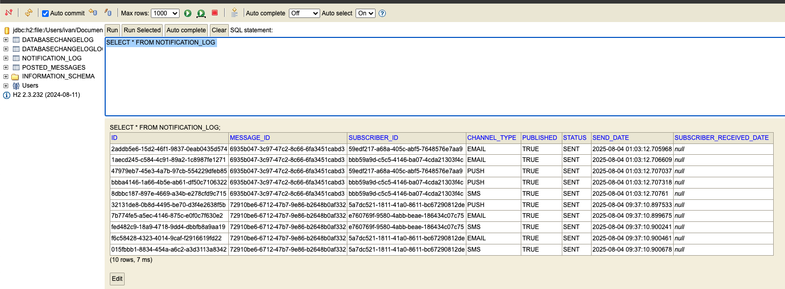

# notification-task
Service to delivery notifications


## Start application
This application starts as regular SpringBoot service
```mvn spring-boot:run``` 
- H2 DB file must be created in dir ```./db/notificationDb.mv```

## Go to User Interface 
local development  : http://localhost:8080/
It looks like -> 
When and error is reported -> 

### Post a new message
- Fill the category and Message section
- Click on ```POST``` button
- If operation is success, the blue banner is show. Otherwise, a red banner is show
- Messages Posted will be displayed in ```Latest messages published``` section
- Check logs to see which users and how they were notified, each represent which third party service is going to use. Logs looks like: ```Note: Message wil be sent in a thread with name prefix NotifTrd-``` 
``` declarative
2025-08-04T09:37:10.858-06:00  INFO 57276 --- [notification] [nio-8080-exec-7] c.f.n.service.NotifierDelegator          : Notifications for users subscribed to Category MOVIES is in process
2025-08-04T09:37:10.883-06:00  INFO 57276 --- [notification] [nio-8080-exec-7] c.f.n.s.impl.MessageLogServiceImpl       : NotificationMessageLog created with id: 72910be6-6712-47b7-9e86-b2648b0af332 and sending Notifications to users in background
2025-08-04T09:37:10.885-06:00  INFO 57276 --- [notification] [     NotifTrd-1] c.f.n.p.NotificationEventManager         : Sending MOVIES notification to 5 users
2025-08-04T09:37:10.892-06:00  INFO 57276 --- [notification] [     NotifTrd-1] c.f.n.l.impl.PushNotificationChannel     : Push to Mali: Someone has publish a message with category MOVIES, where body is Spoof comedies can sometimes feel like a scarce resource. They tend to appear in brief, market-saturating feasts, as in the early ‘90s or the mid-2000s, before disappearing for lengthy periods of.
2025-08-04T09:37:10.898-06:00  INFO 57276 --- [notification] [     NotifTrd-1] c.f.n.l.impl.EmailNotificationChannel    : Email to rocky@mock.com: Someone has publish a message with category MOVIES, where body is Spoof comedies can sometimes feel like a scarce resource. They tend to appear in brief, market-saturating feasts, as in the early ‘90s or the mid-2000s, before disappearing for lengthy periods of.
2025-08-04T09:37:10.899-06:00  INFO 57276 --- [notification] [     NotifTrd-1] c.f.n.l.impl.SMSNotificationChannel      : SMS to 55-55-55-55-55: Someone has publish a message with category MOVIES, where body is Spoof comedies can sometimes feel like a scarce resource. They tend to appear in brief, market-saturating feasts, as in the early ‘90s or the mid-2000s, before disappearing for lengthy periods of.
2025-08-04T09:37:10.900-06:00  INFO 57276 --- [notification] [     NotifTrd-1] c.f.n.l.impl.EmailNotificationChannel    : Email to mali@mock.com: Someone has publish a message with category MOVIES, where body is Spoof comedies can sometimes feel like a scarce resource. They tend to appear in brief, market-saturating feasts, as in the early ‘90s or the mid-2000s, before disappearing for lengthy periods of.
2025-08-04T09:37:10.900-06:00  INFO 57276 --- [notification] [     NotifTrd-1] c.f.n.l.impl.SMSNotificationChannel      : SMS to 99-99-99-99-99: Someone has publish a message with category MOVIES, where body is Spoof comedies can sometimes feel like a scarce resource. They tend to appear in brief, market-saturating feasts, as in the early ‘90s or the mid-2000s, before disappearing for lengthy periods of.
2025-08-04T09:37:10.902-06:00  INFO 57276 --- [notification] [     NotifTrd-1] c.f.n.p.NotificationEventManager         : Storing NotificationLogs generated with ids : b56a109d-0f3f-49b8-9769-4ff63d738e97, f004eef5-74c6-4260-b44a-ee9d758af943, 2c3db8bd-66fc-425a-b2c6-d89dd0902497, 1277afdd-479b-469d-b0cf-7364560012ad, 2066bd2a-0995-4cbb-8743-b8a4ba17b9cb
2025-08-04T09:37:10.975-06:00  INFO 57276 --- [notification] [     NotifTrd-1] c.f.n.p.NotificationEventManager         : Number of notificationLogs inserted 5, expected 5 rows.
```
- To check logs stored in Db go to http://localhost:8080/h2-console and use url: ```jdbc:h2:file:${path to project}/db/notificationDb``` click connect. Use regular ```SELECT * FROM NOTIFICATION_LOG``` to retrieve all records. 
- Check Unit Testing coverage, run command ```mvn clean package``` once complete go to dir ```./target/site/index.html``` where you could see coverage for each file.